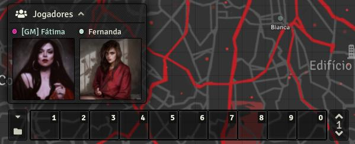

# FoundryVTT - Player Images Miniature
A dodgy module to show the character images from player list.

## Installation

To install, follow these instructions:

1.  Inside Foundry, select the Game Modules tab in the Configuration and Setup menu.
2.  Click the Install Module button and enter the following URL:
https://github.com/zerodois/player-images/releases/download/v1.0.2/module.json
3.  Click Install and wait for installation to complete.

## Player Images Miniature, it's :

1. __**Online and offline characters with new UI**__
    
    
2. __**Translation**__, Portuguese and English!

## Version & Compatibility

- Tested on 0.8.9 version.